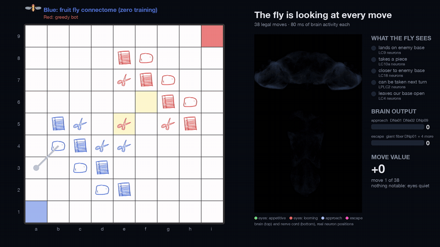
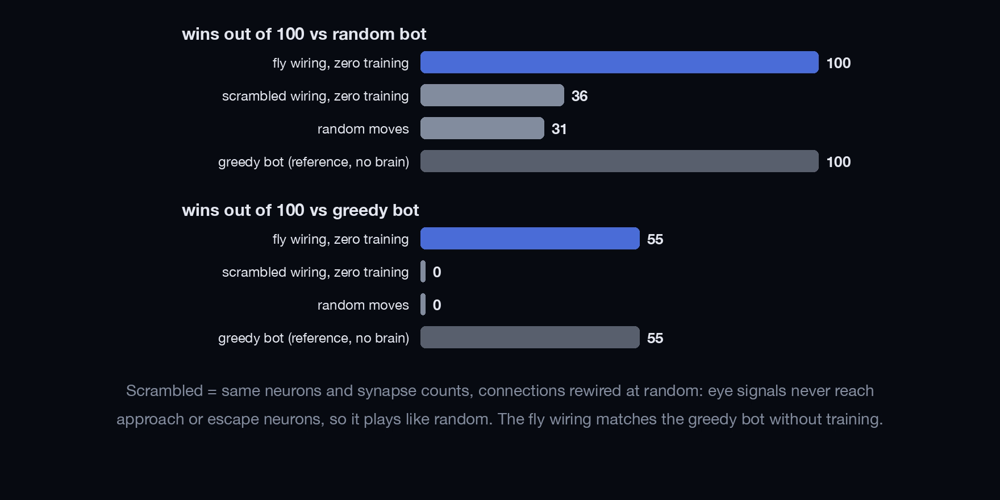
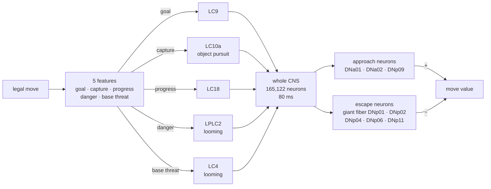
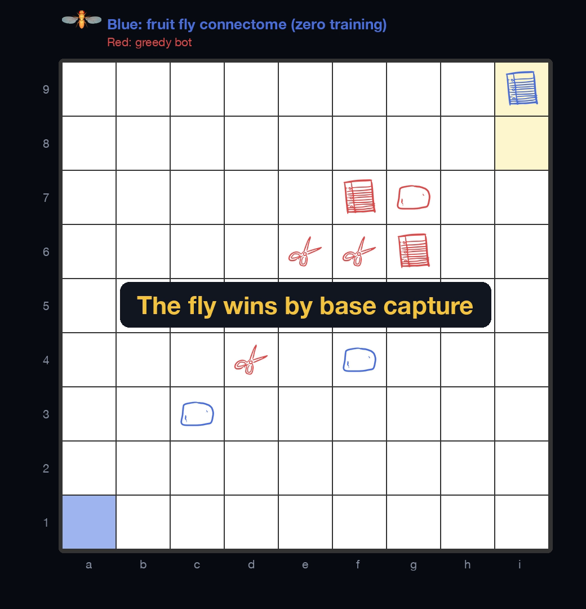

<div align="center">

# 🪰 flybrain-intransitive

### A real fruit fly nervous system plays rock-paper-scissors chess. With zero training.

**165,122 simulated neurons · no learned weights · the fly's own escape reflex decides what's dangerous**



*Left: [Intransitive](https://meaf.us/rps2/), fly plays blue. Right: every spike in the fly's brain (top) and nerve cord (bottom) while it looks at each legal move.*

[**▶ Full demo video (64 s)**](media/fly_plays_intransitive.mp4) · [How it works](#how-it-works) · [Results](#results) · [Caveats](#honest-caveats) · [Run it](#run-it-yourself)

**Similar project:** [flybrain-snake](https://github.com/charbelkassab/flybrain-snake), the same fly connectome playing Snake.

</div>

---

## TL;DR

- 🎮 **The game:** [Intransitive](https://meaf.us/rps2/) is rock-paper-scissors chess: 9×9 board, pieces move like
  chess kings, you can only capture what you beat, and you win by stepping onto the enemy base.
- 🧠 **The player:** the full MaleCNS v1.0 fruit fly connectome (brain + nerve cord), simulated as spiking neurons.
- 👁 **How it decides:** every legal move is shown to the fly's eyes. Good things (take a piece, get closer, win) look
  like small objects to chase. Bad things (piece could be taken, base left open) look like something **looming** toward it.
- ⚡ **What falls out of the wiring:** looming input fires the **giant fiber**, the fly's real escape neuron, 20–30× harder
  than any appetitive input drives approach. The fly plays the move with the most approach and the least escape.
- 🏆 **Result:** with **no training at all**, it beats random play **100–0** and matches a greedy bot **55–45**.
  Scramble the wiring and it can't tell good moves from bad (**0** wins vs the greedy bot).

<div align="center">

</div>

---

## The game

Rules ported from the site's client code ([`rps2.py`](rps2.py)):

| | |
|---|---|
| Board | 9×9, files a–i, ranks 1–9 |
| Bases | blue **a1**, red **i9** |
| Pieces | 3 rocks, 4 papers, 3 scissors per side, in a diagonal wall |
| Movement | one square in any direction (chess king) |
| Capture | only a piece you beat: rock → scissors → paper → rock |
| Win | move onto the enemy base, or leave the opponent with no legal move |
| Draw | too long without a capture (server-side limit not in the client; **200 plies assumed**) |

Everything runs locally. No bot was connected to the live site or played against real people.

## How it works



For every legal move (typically 20–40 per turn):

1. **Describe the move** with 5 yes/no features, from the moving side's point of view:

   | feature | meaning | stimulates (both eyes, 150 Hz) |
   |---|---|---|
   | `goal` | lands on the enemy base | **LC9** visual projection neurons |
   | `capture` | takes an enemy piece | **LC10a**, small-object detectors males use to chase females |
   | `progress` | ends closer to the enemy base | **LC18** |
   | `danger` | an enemy piece that beats it could take it next turn | **LPLC2**, looming detectors |
   | `base_threat` | afterwards the enemy can step onto our base | **LC4**, looming detectors |

2. **Run the whole nervous system for 80 ms** from rest: 165,122 leaky integrate-and-fire neurons wired as in the connectome.
3. **Score the move** = spikes in approach descending neurons − spikes in escape descending neurons.
4. **Play the highest-scoring move** (ties broken at random). Moves with no features leave the eyes and brain quiet and score 0.

### What the brain does with each feature

Average over 12 simulations, 80 ms each, one feature at a time:

| feature | approach spikes − escape spikes |
|---|---:|
| lands on enemy base | **+6.7** |
| takes a piece | **+6.2** |
| gets closer | **+2.9** |
| can be taken next turn | **−115.9** |
| leaves our base open | **−196.9** |

No weights or neuron parameters were tuned for this game (the feature-to-neuron mapping was chosen by hand, see [caveats](#honest-caveats)). The sizes come from the wiring: object detectors feed steering and approach
neurons weakly, while looming detectors slam into the **giant fiber escape circuit**, the pathway that makes a real fly
jump away from a swatter. So the fly plays like a cautious animal: never walk into danger, never leave home open,
otherwise chase.

<div align="center">

</div>

---

## Results

100 games per matchup, colors alternating. Brain responses come from simulations held out from any fitting.
Full numbers in [`results/scoreboard.json`](results/scoreboard.json).

| player | vs random bot (W-D-L) | vs greedy bot (W-D-L) |
|---|---|---|
| **fly wiring, zero training** | **100-0-0** | **55-0-45** |
| fly wiring + linear readout (1,314 descending neurons) | 100-0-0 | 38-0-62 |
| scrambled wiring, zero training | 36-34-30 | 0-0-100 |
| scrambled wiring + linear readout | 77-13-10 | 0-0-100 |
| random moves | 31-30-39 | 0-0-100 |
| greedy bot (reference, no brain) | 100-0-0 | 55-0-45 |

- **The untrained fly scores the same as the greedy bot does against itself** (55–45 in both cases).
- **Scrambled wiring** keeps the same neurons, synapse counts and signs but sends every connection to a random target.
  Eye input then produces **zero** approach or escape spikes, so every move looks the same and it plays randomly.
- **A learned readout didn't help** (38 wins vs 55). A linear decoder over all 1,314 descending neurons, fit to the
  reference evaluation, played worse than simply reading the approach and escape neurons the biology points to.

The greedy bot is "take the best-looking move right now", using the same 5 features with fixed weights
(win ≫ don't open base ≫ capture > avoid danger > progress).

---

## Honest caveats

| | |
|---|---|
| ✅ real | connectome wiring, neuron identities (LC9, LC10a, LC18, LPLC2, LC4, DNa01/02, DNp01/02/04/06/09/11), the sign and ordering of move values |
| ⚠️ hand-designed | the 5 move features, and which neurons stand for "good" vs "threat". I checked which visual neurons drive approach vs escape before assigning them (looming → escape matches known biology) |
| ⚠️ simplified | every neuron is the same LIF unit; synapse strength = synapse count × constant; brain reset between moves |
| ⚠️ weak opponent | the greedy bot looks one move ahead. Any real search engine would beat both |
| ❌ not modeled | learning, memory across moves, neuromodulation, a body |

So the fly isn't "understanding" the game. The game is translated into things a fly already cares about (prey,
threats), and the fly's wiring decides between them surprisingly well.

## Model details

The brain model is shared with [flybrain-snake](https://github.com/charbelkassab/flybrain-snake#model-details):
whole-brain LIF model after Shiu et al. 2024 (*Nature*), with changes needed to keep the MaleCNS from
locking into runaway activity (lower synapse gain, spike adaptation, modulatory transmitters not treated as fast synapses,
Kenyon cell ↔ Kenyon cell contacts and inputs onto sensory neurons dropped). All of it is in [`brain.py`](brain.py).

## Run it yourself

Requires Python 3.11+, ~2 GB disk, ~8 GB RAM, and `rsvg-convert` (librsvg) for the piece icons. Tested on an M-series Mac.

```sh
git clone https://github.com/charbelkassab/flybrain-intransitive.git
cd flybrain-intransitive
python3 -m venv .venv && .venv/bin/pip install -r requirements.txt

./scripts/download_data.sh              # 1.1 GB of connectome tables from Janelia
./scripts/fetch_piece_icons.sh          # piece icons from the game site (not redistributed here)
.venv/bin/python build_connectome.py    # -> data/brain.npz, ~1 min
.venv/bin/python experiment.py          # scoreboard, ~2 min
.venv/bin/python demo.py                # -> videos/fly_plays_intransitive.mp4, ~3 min
```

`demo.py` uses macOS system fonts (Helvetica Neue); on Linux, change `FONT` at the top of the file.

Things to try:

- Remap features to other visual neurons in `brain.py` (`CHANNELS`), e.g. `LPLC1`, `LC6`, `LC17`.
- Change which descending neurons count as approach / escape (`APPROACH_TYPES`, `ESCAPE_TYPES`).
- Lesion the giant fiber (drop `DNp01` from `ESCAPE_TYPES`, or zero its connections) and watch the fly get reckless.

## Repository layout

```
rps2.py                game rules (ported from the site), move features, greedy reference
brain.py               LIF simulator, stabilisation, scrambled-wiring control, input/output neuron sets
experiment.py          records brain responses per feature pattern, plays 100 games per matchup
demo.py                renders the video with live simulation of every evaluated move
build_connectome.py    Janelia feather files -> signed sparse matrix
scripts/               connectome download, piece icon fetch
results/               scoreboard + fitted readouts
media/                 video, GIF, figures
assets/fly_top.png     top-down render of the flybody fly model
```

## Credits

- **Game:** [Intransitive](https://meaf.us/rps2/) by meaf. Rules reimplemented from the public client for local play;
  piece artwork belongs to the site and is fetched, not included.
- **Connectome:** MaleCNS v1.0, Google Research & HHMI Janelia FlyEM, *Cell* (2026).
  [male-cns.janelia.org](https://male-cns.janelia.org/), CC-BY 4.0.
- **Whole-brain LIF model:** Shiu, P.K. et al. *A Drosophila computational brain model reveals sensorimotor processing.* Nature (2024).
- **Fly model** (sprite): flybody, Vaxenburg, R. et al. *Whole-body physics simulation of fruit fly locomotion.* Nature (2025),
  [TuragaLab/flybody](https://github.com/TuragaLab/flybody), Apache 2.0.

## Similar project

**[flybrain-snake](https://github.com/charbelkassab/flybrain-snake)**: the same connectome plays Snake. Fruit seen by
the left eye makes the left turning neurons fire with zero training; with a learned readout it scores 25 per game,
and scrambled wiring collapses to 4.

## License

Code: [MIT](LICENSE). Connectome data (CC-BY 4.0) and piece icons are downloaded by scripts, not redistributed.
